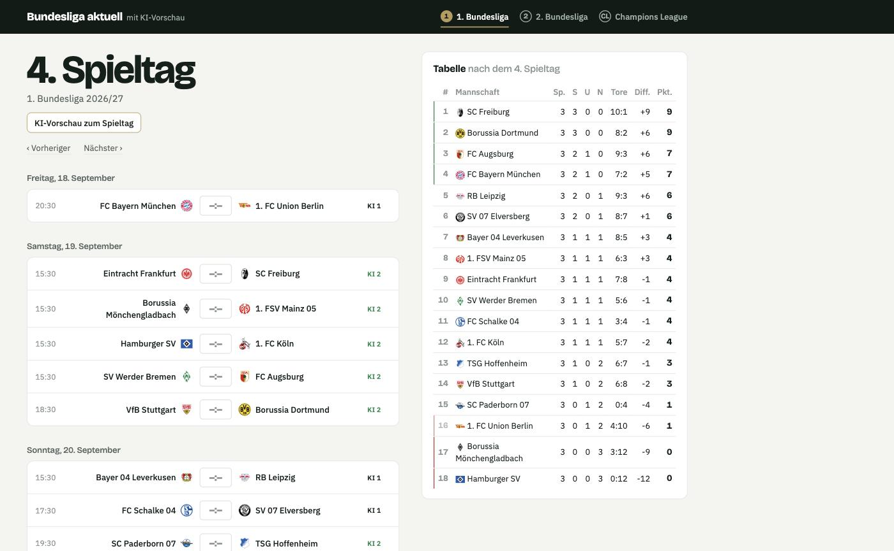
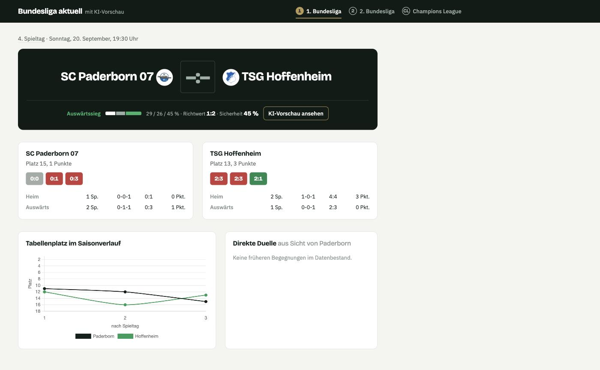
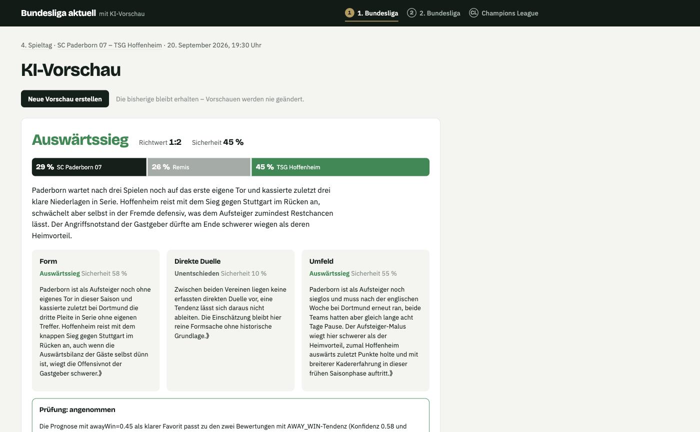
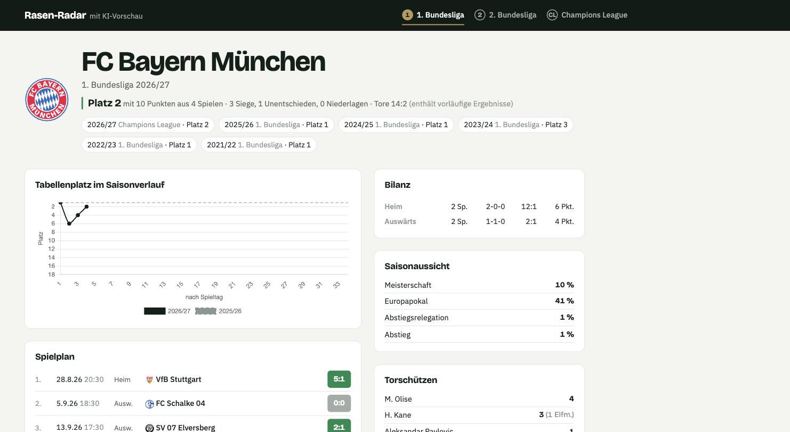
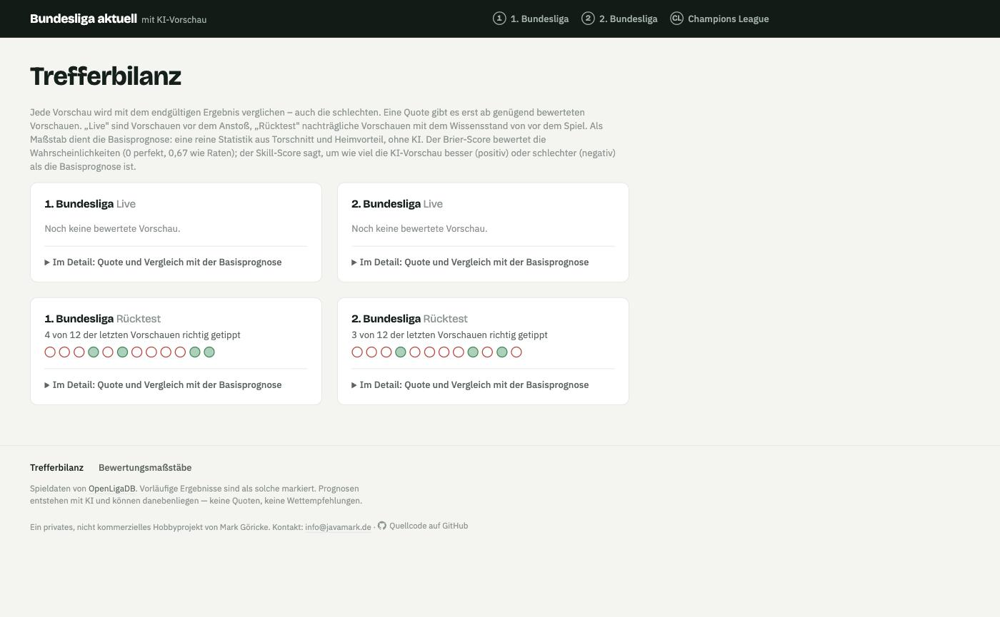

# Rasen-Radar

**Rasen-Radar – mit KI-Vorschau**

[](https://github.com/mgoericke/rasenradar/actions/workflows/build.yml)
[](https://github.com/mgoericke/rasenradar/actions/workflows/security.yml)
[](LICENSE)
[](https://openjdk.org/projects/jdk/21/)
[](https://quarkus.io/)

Aktuelle Spieltage, Tabellen und Vereinsdaten der 1./2. Bundesliga und der Champions-League-Ligaphase — plus eine KI-Vorschau je Begegnung, die sich selbst an ihrer eigenen Trefferbilanz messen lässt.

**Live:** [rasenradar.markserver.de](https://rasenradar.markserver.de)

> [!NOTE]
> Ein privates, nicht kommerzielles Hobbyprojekt eines Bundesliga-Fans. Keine Quoten, keine Wettempfehlungen — die KI-Vorschau ist eine Einschätzung, kein Rat.

## Screenshots

| Spieltag | Begegnung |
|---|---|
|  |  |

| KI-Vorschau | Vereinsseite |
|---|---|
|  |  |

**Trefferbilanz** — wie gut die KI-Vorschau wirklich ist, gemessen an einer reinen Statistik-Basisprognose:



## Features

- **Spieldaten in Echtzeit** — 1./2. Bundesliga und die Champions-League-Ligaphase, alle 15 Minuten mit [OpenLigaDB](https://www.openligadb.de) abgeglichen. Ergebnisse gelten erst 24 Stunden nach Anstoß als endgültig; vorläufige Ergebnisse sind im UI klar markiert.
- **Abgeleitete Fakten** — Form (letzte 5 Saisonspiele), direkte Duelle über mehrere Saisons, Tabelle „vor Spieltag N", Heim-/Auswärtsbilanz, Torschützen je Verein.
- **Vereinsseiten** — Tabellenplatz im Saisonverlauf, kompletter Spielplan, Bilanz, Torschützen, Verlinkung zu Vorsaisons (auch über Ligagrenzen hinweg bei Auf-/Absteigern).
- **KI-Vorschau** — ein agentischer Workflow (LangChain4j) aus drei parallelen Bewertern (Form, direkte Duelle, Umfeld), einem Prognostiker und einem Prüfer mit einer Überarbeitungsrunde. Modell: Anthropic Claude Sonnet 5, lokales Ollama als Fallback im Dev-Modus. Eine Prognose wird nie geändert oder gelöscht — eine erneute ist ein neuer Eintrag.
- **Rückschau mit Trefferbilanz** — jede Prognose wird gegen das endgültige Ergebnis geprüft (Tendenztreffer, Brier-Score, Sicherheitskalibrierung) und gegen eine statistische Basisprognose (Poisson-Schätzung aus Torschnitt und Heimvorteil) verglichen. Eine Quote gibt es erst ab genügend Datenbasis — vorher ausdrücklich nichts statt einer dünnen Zahl. Dazu eine einfache Trefferverlauf-Ansicht ohne Statistikwissen.
- **Rücktest-Modus** — Prognosen für bereits gespielte Begegnungen der laufenden Saison, sofort bewertet, getrennt von Live-Prognosen ausgewiesen.

## Architektur

Boundary–Control–Entity je fachlichem Feature (`matchday`, `forecast`, `review`), Abhängigkeitsrichtung per [ArchUnit](https://www.archunit.org/) erzwungen. Details, Sequenzdiagramme und Architekturentscheidungen: [`docs/architecture/`](docs/architecture/).

**Stack:** Quarkus 3.39 · Java 21 · PostgreSQL/Flyway · Hibernate ORM mit Panache · LangChain4j agentic · Qute + htmx + Chart.js, kein SPA.

## Lokal ausprobieren

Kein Java, kein Maven nötig — zieht das veröffentlichte Image:

```bash
docker compose up
```

Danach [localhost:8080](http://localhost:8080). Für die KI-Vorschau vorher `export ANTHROPIC_API_KEY=...` setzen; alles andere (Spieltage, Tabellen, Vereine, Trefferbilanz) funktioniert auch ohne.

## Entwicklung

```bash
./mvnw quarkus:dev     # Dev-Modus mit Live-Reload, Dev UI: http://localhost:8080/q/dev/
./mvnw test             # Tests (ArchUnit eingeschlossen)
```

Voraussetzungen: Docker (für den Postgres-Dev-Service via Compose Dev Services), ein `ANTHROPIC_API_KEY` in der Umgebung oder in einer lokalen `.env` für die KI-Vorschau — ohne Key fällt der Workflow auf ein lokales Ollama-Modell zurück.

Details zu Arbeitsweise, Glossar und Fachregeln: [`CLAUDE.md`](CLAUDE.md). UI-Styleguide: [`docs/styleguide.md`](docs/styleguide.md).

## Deployment

Docker Compose hinter Traefik, automatisch über GitHub Actions. Details: [`deployment/`](deployment/DEPLOYMENT.md).

## Lizenz

[MIT](LICENSE)
