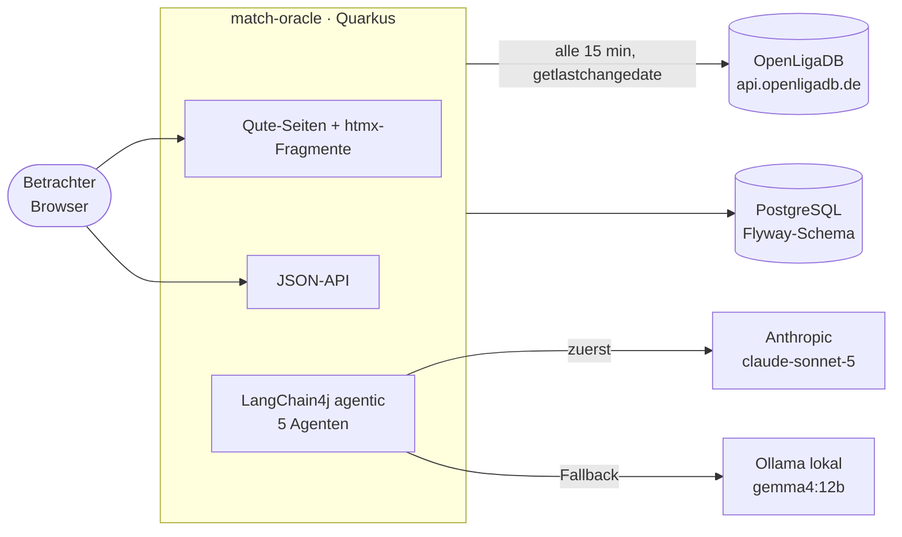
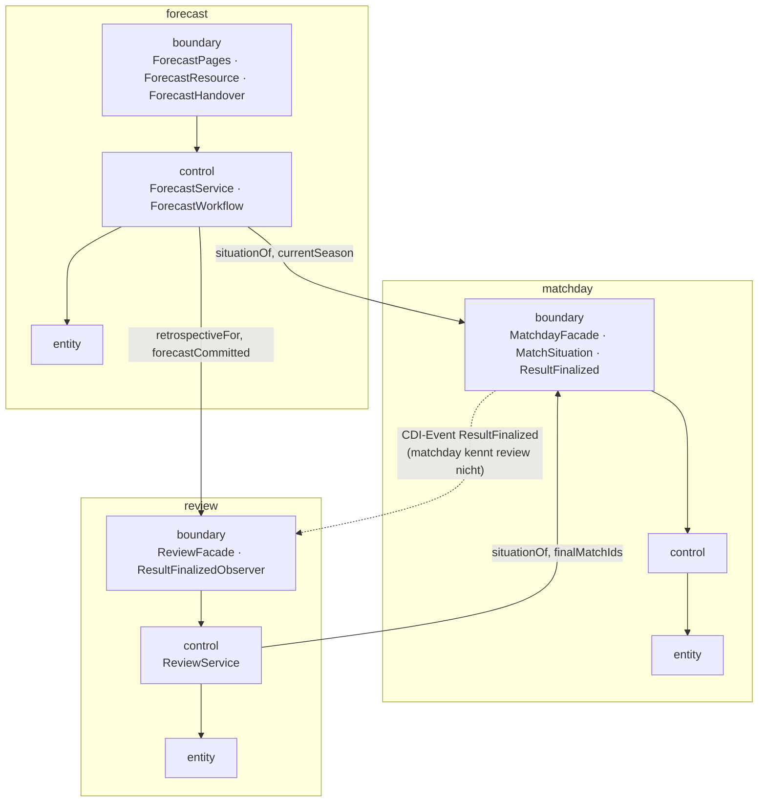

# Architektur „Rasen-Radar – mit KI-Vorschau“

Stand: September 2026. Quarkus 3.39, Java 21, Maven Wrapper. Basispackage `de.javamark.matchoracle`.

## Inhalt

| Dokument | Inhalt |
|---|---|
| [README.md](README.md) (dieses) | Überblick, Kontext, Feature-Schnitt, Abhängigkeitsregeln |
| [ablaeufe.md](ablaeufe.md) | Die wichtigen Abläufe als Sequenz- und Flussdiagramme mit Verweis auf die Klassen |
| [entscheidungen.md](entscheidungen.md) | Architekturentscheidungen im knappen ADR-Stil |

Verwandte Dokumente außerhalb dieses Verzeichnisses: die fachlichen Specs unter `docs/specs/`, die Kostenschätzung `docs/kosten-cloud-modelle.md`, der UI-Styleguide `docs/styleguide.md`, die Arbeitsregeln und das Glossar in `CLAUDE.md`.

## Was die Anwendung tut

Die Anwendung hält Begegnungen und Ergebnisse der 1. und 2. Bundesliga (laufende Saison plus zwei Vorsaisons) aktuell, leitet daraus Tabelle, Form und direkte Duelle ab und erstellt auf Wunsch je Begegnung eine KI-Vorschau: drei Bewerter-Agenten, ein Prognostiker und ein Prüfer liefern Tendenz, Wahrscheinlichkeiten, Richtwert für das Ergebnis, Sicherheitsgrad und Begründung. Sobald ein Ergebnis endgültig ist, bewertet die Rückschau jede dazu festgeschriebene Prognose und weist eine Trefferbilanz aus, gemessen an einer statistischen Basisprognose. Keine Quoten, keine Wettempfehlungen.

## Kontext

| Baustein | Technik | Wo |
|---|---|---|
| Spieldaten | OpenLigaDB, REST-Client (`quarkus-rest-client-jackson`), kein API-Key | `matchday.control.OpenLigaDbClient` |
| Persistenz | PostgreSQL, Hibernate ORM mit Panache (Active Record), Flyway-Migrationen `V1`–`V7` | `*/entity`, `src/main/resources/db/migration/` |
| Agenten | `quarkus-langchain4j-agentic` (deklarativer Workflow), Anthropic + Ollama | `forecast.control` |
| Zeitsteuerung | `quarkus-scheduler` (Sync, Nachholläufe) | `matchday.boundary.MatchdaySyncScheduler`, `review.boundary.ReviewCatchUp`, `forecast.boundary.ForecastHandover` |
| UI | Qute (`@CheckedTemplate`), htmx 2 und Chart.js 4 lokal unter `META-INF/resources/vendor/`, kein SPA | `*/boundary/*Pages`, `src/main/resources/templates/` |
| Architekturtest | ArchUnit | `src/test/java/de/javamark/matchoracle/ArchitectureTest.java` |
| Entwicklung | Compose Dev Services (`compose-devservices.yml`, Postgres 18, fester Port 5432) | `application.properties`, `%dev`-Profil |

## Feature-Schnitt: BCE je Feature

Jedes fachliche Feature ist ein Package mit den drei Schichten Boundary, Control, Entity. Innerhalb eines Features gilt: `boundary → control → entity`, nie rückwärts. Über Feature-Grenzen hinweg darf ausschließlich das `boundary`-Package des anderen Features benutzt werden.

| Feature | Spec | Boundary (Einstiege) | Control (Fachlogik) | Entity (Modell) |
|---|---|---|---|---|
| `matchday` | 01 Spieltagsdaten | `MatchdayPages`, `MatchdayResource`, `MatchdaySyncScheduler`, `MatchdayFacade`, `MatchSituation`, Event `ResultFinalized` | `MatchdaySynchronizer`, `OpenLigaDbClient`, `ResultFinalizer`, `FormCalculator`, `StandingsCalculator`, `HeadToHeadCalculator`, `ScorerCalculator` | `League`, `Matchday`, `Match`, `Team`, `Goal`, `Score`, `ResultStatus`, `Form`, `Standings`, `HeadToHead`, `Balance`, `TeamMatchView` |
| `forecast` | 02 Spieltag-Prognose | `ForecastPages`, `ForecastResource`, `ForecastHandover` | `ForecastQueue`, `ForecastService`, `ForecastWorkflow`, `FormAssessor`, `HeadToHeadAssessor`, `ContextAssessor`, `Forecaster`, `Reviewer`, `ResilientAssessors`, `FallbackChatModel`, `FactSheet`, `ForecastProgress`, `Probabilities` | `Forecast`, `Assessment`, `ForecastParameters`, `Outcome`, `Verdict` |
| `review` | 03 Rückschau und Lernen | `ResultFinalizedObserver`, `ReviewFacade`, `ReviewCatchUp`, `ReviewPages`, `ReviewResource` | `ReviewService`, `BaselineForecast`, `Evaluation`, `Similarity`, `RetrospectiveText` | `Situation`, `RecordedForecast`, `ForecastEvaluation`, `SimilarCase`, `Retrospective`, `AccuracyReport`, `Baseline` |

## Abhängigkeiten zwischen den Features

Regeln, die `ArchitectureTest` prüft:

1. **BCE-Schichten** (`bce_layers`): innerhalb eines Features darf `entity` weder `control` noch `boundary` kennen, `control` nicht `boundary`.
2. **Zusammenarbeit nur über Boundary** (`features_collaborate_only_via_boundary`): keine Klasse greift in `control` oder `entity` eines fremden Features.
3. **Keine Zyklen** (`features_are_free_of_cycles`): die Feature-Packages sind als Slices zyklenfrei.

Daraus ergibt sich der erlaubte Graph `forecast → {matchday, review}` und `review → matchday`. Die fachlich nötige Rückrichtung `matchday → review` (ein Ergebnis wird endgültig, die Rückschau soll reagieren) läuft über das CDI-Event `ResultFinalized`, das in `matchday.boundary` liegt und von `review.boundary.ResultFinalizedObserver` beobachtet wird. `forecast → review` ist dagegen ein direkter Aufruf (`ReviewFacade.forecastCommitted`), weil `forecast` ohnehin von `review` abhängt (Rückschau). Fremde Features sehen nie Entities: `MatchdayFacade` liefert `MatchSituation` (Records mit reinen Werten), `ReviewFacade` nimmt `CommittedForecast` entgegen und gibt die Rückschau als Text zurück.

Auf HTML-Ebene wird die Abhängigkeitsrichtung ebenfalls eingehalten: die Spiel- und Spieltagsseiten des `matchday`-Features laden per htmx Fragmente von `forecast` (`summary`, `markers`), ohne dass `matchday`-Java-Code das Feature `forecast` kennt.

## Persistenz auf einen Blick

| Migration | Inhalt |
|---|---|
| `V1__matchday_schema.sql` | `team`, `matchday` (unique `league, season, number`), `match`, `goal`; eine Sequenz je Entity |
| `V2__matchday_last_checked_at.sql` | Alter der Daten für die Anzeige |
| `V3__forecast_schema.sql` | `forecast_parameters` (eine Zeile), `forecast` (Check: Wahrscheinlichkeiten summieren zu 1), `assessment` |
| `V4__team_icon_url.sql` | Wappen-URL |
| `V5__review_schema.sql` | `situation`, `recorded_forecast`, `forecast_evaluation`, Spalte `forecast.retrospective` |
| `V6__backtest_flag.sql` | `backtest`-Flag auf Prognose, Kopie und Bewertung |
| `V7__situation_baseline.sql` | Basisprognose je Ausgangslage |

Hibernate läuft mit `schema-management.strategy=validate`; das Schema gehört Flyway.

## Einstiegspunkte (HTTP)

| Pfad | Feature | Art |
|---|---|---|
| `/`, `/{league}`, `/{league}/{season}/{number}`, `/{league}/matches/{id}`, `/{league}/teams/{id}` | matchday | HTML |
| `/leagues/{league}/...` | matchday | JSON |
| `/{league}/matches/{id}/forecast` (+ `/progress`, `/summary`), `/{league}/{season}/{number}/forecasts` (+ `/markers`, `/backtests`), `/so-entsteht-eine-prognose` | forecast | HTML / htmx-Fragmente |
| `/forecasts/...` | forecast | JSON |
| `/trefferbilanz` | review | HTML |
| `/review/accuracy/{league}`, `/review/evaluations/{forecastId}` | review | JSON |

Ligen werden überall über die OpenLigaDB-Kürzel `bl1` und `bl2` angesprochen.
