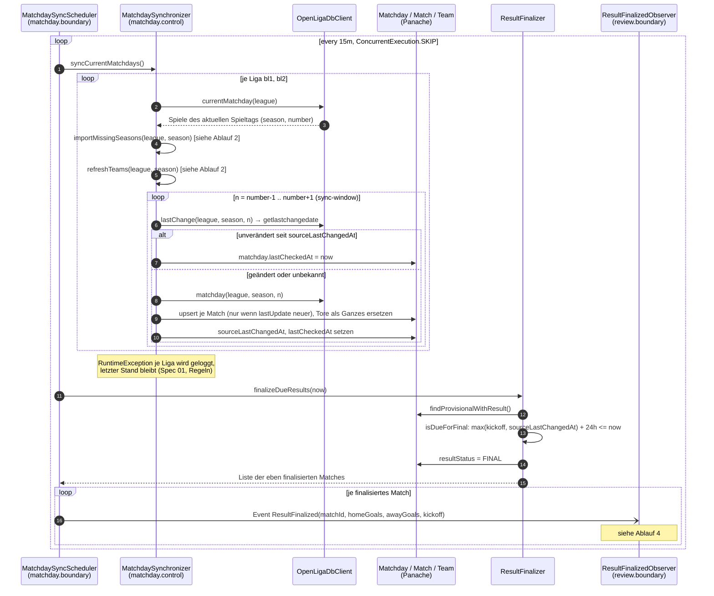
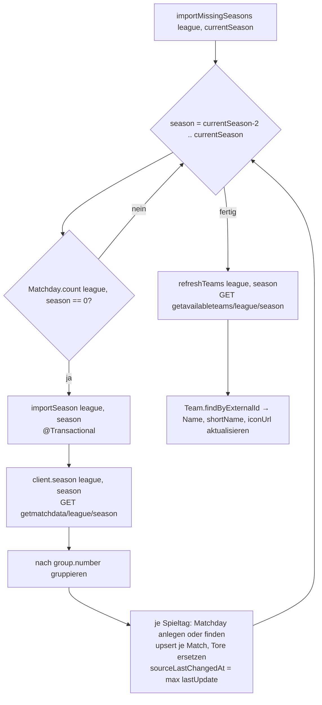
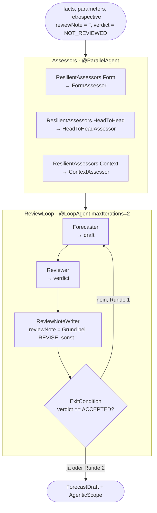
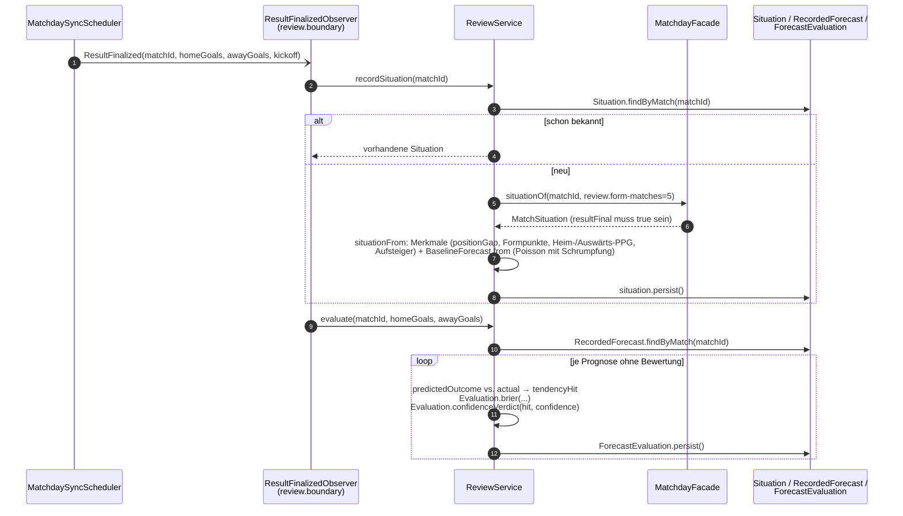
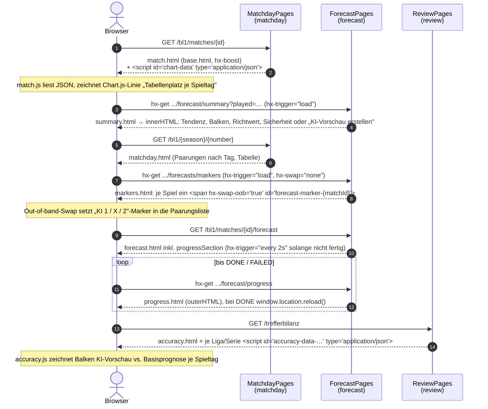

# Abläufe

Die wichtigen Abläufe mit Verweis auf die beteiligten Klassen. Konfigurationswerte stammen aus `src/main/resources/application.properties`.

## 1. Spieltag-Synchronisation und Finalisierung

Alle 15 Minuten (`matchoracle.matchday.sync-interval`, erster Lauf beim Start) prüft der Scheduler beide Ligen. Ein Spieltag wird nur nachgeladen, wenn `getlastchangedate` bei OpenLigaDB neuer ist als der gespeicherte Stand. Danach werden vorläufige Ergebnisse endgültig, deren Anstoß und letzte Quellenänderung 24 h (`final-after`) zurückliegen; für jedes fires der Scheduler das CDI-Event `ResultFinalized`.



Anmerkungen:

- `syncMatchday` ist je Spieltag eine eigene Transaktion; `syncCurrentMatchdays` läuft mit `@ActivateRequestContext`, weil Panache außerhalb einer Transaktion einen Request-Kontext braucht.
- Ändert die Quelle ein bereits endgültiges Ergebnis, übernimmt `upsert` die Korrektur, lässt den Status aber auf `FINAL` und loggt eine Warnung.
- Zeitstempel von OpenLigaDB außer `matchDateTimeUTC` sind Ortszeit ohne Zone; `OpenLigaDb.toInstant` interpretiert sie als `Europe/Berlin`.

## 2. Initial-Import der Historie

Läuft innerhalb der Synchronisation (Ablauf 1, Schritt 3 und 4). Für die laufende Saison und `history-seasons` (2) Vorsaisons wird eine Saison komplett geladen, sobald für sie noch kein Spieltag bekannt ist. `refreshTeams` aktualisiert Namen, Kürzel und Wappen aller Mannschaften der Saison, auch wenn sich keine Spiele geändert haben.



Mannschaften werden ausschließlich über die stabile `teamId` der Quelle (`Team.externalId`) identifiziert; Namen sind änderbare Eigenschaften. Begegnungen ebenso über `matchID` (`Match.externalId`).

## 3. KI-Vorschau erstellen (Prognose)

Der Betrachter startet die Vorschau auf der Seite oder per JSON-API. Die Anfrage landet in `ForecastQueue` (ein Hintergrund-Thread, Läufe nacheinander), die Seite pollt den Fortschritt per htmx. `ForecastService.forecast` sammelt Fakten und Rückschau, führt den deklarativen `ForecastWorkflow` aus, schreibt die unveränderliche Prognose und übergibt sie an `review`.

```mermaid
sequenceDiagram
    autonumber
    actor V as Betrachter
    participant P as ForecastPages /<br/>ForecastResource
    participant Q as ForecastQueue<br/>(1 Thread)
    participant S as ForecastService
    participant MF as MatchdayFacade<br/>(matchday.boundary)
    participant RF as ReviewFacade<br/>(review.boundary)
    participant W as ForecastWorkflow<br/>(agentic)
    participant Pr as ForecastProgress

    V->>P: POST /{league}/matches/{id}/forecast
    P->>MF: situationOf(id, 1).played  → backtest?
    P->>Q: enqueue(matchId, backtest)
    P-->>V: 303 → Vorschau-Seite
    loop htmx hx-trigger="every 2s"
        V->>P: GET .../forecast/progress
        P->>Pr: of(matchId)
        P-->>V: Fragment progress.html (Schritte WAITING/RUNNING/DONE/FAILED)
    end

    Q->>S: forecast(matchId, backtest)  [@ActivateRequestContext]
    S->>Pr: start(matchId)
    S->>S: ForecastParameters.current()
    S->>MF: situationOf(matchId, parameters.formMatches)
    MF-->>S: MatchSituation (Form, Tabelle, Bilanzen, Direktduelle)
    S->>S: Prüfungen: live nur ungespielt; Rücktest nur gespielt und laufende Saison
    S->>S: FactSheet.render(situation), FactSheet.parameters(parameters)
    S->>RF: retrospectiveFor(matchId)
    RF-->>S: Optional<String> (leer bei < 3 Vergleichsfällen)  [siehe Ablauf 5]
    S->>W: run(facts, parameters, retrospective, reviewNote="", verdict=NOT_REVIEWED)
    Note over W: siehe Diagramm unten
    W-->>S: ResultWithAgenticScope<ForecastDraft>
    alt OutputParsingException in der Ursachenkette
        S->>W: run(...) ein zweites Mal
    end
    S->>S: commit(...): Probabilities.normalized, confidence(), Forecast + 3 Assessments persist
    S->>RF: forecastCommitted(CommittedForecast)   [handOver]
    S->>Pr: done(matchId, forecastId)
    Note over V: Fragment mit state DONE lädt die Seite neu
```

### Der Agenten-Workflow im Detail

`ForecastWorkflow` ist ein `@SequenceAgent` aus zwei Teilen: `Assessors` (`@ParallelAgent`) und `ReviewLoop` (`@LoopAgent`, `maxIterations = 2`). Die Schleife endet vorzeitig, sobald `verdict.verdict() == ACCEPTED`. Weil die `@ExitCondition` nach jedem Sub-Agenten ausgewertet wird, wird `verdict` vom Aufrufer mit `NOT_REVIEWED` (= `REVISE`, leerer Grund) vorbelegt.



Details:

- **Ausfallsicherheit der Bewerter:** `ResilientAssessors.guarded` ruft den eigentlichen Bewerter auf, versucht es bei einer Exception genau einmal erneut und liefert danach `AssessmentResult.failed(...)` statt den Lauf abzubrechen. Der Prognostiker wird per Prompt angewiesen, bei Ausfall breiter zu verteilen.
- **Sicherheitsgrad:** nicht vom Modell erfragt, sondern `ForecastService.confidence` = Wahrscheinlichkeit der Tendenz × 0,75 je ausgefallener Bewertung.
- **Prüfer-Ergebnis:** `revised` = `reviewNote` nicht leer; `objectionRemains` = Urteil nach der letzten Runde noch `REVISE`. War der Prüfer nie dran (`NOT_REVIEWED` im Scope), wird `ACCEPTED` mit Hinweis „Keine Prüfung erfolgt." gespeichert.
- **Modellwahl:** jeder der fünf Agenten liefert per `@ChatModelSupplier` `FallbackChatModel.resilient()`. Der Aufruf geht zuerst an das benannte Modell `cloud` (`claude-sonnet-5`, `response-format=json`, Temperatur 0,3, gecachte Systemprompts) und bei einer RuntimeException (nicht erreichbar, kein Key, Guthaben leer, Timeout) an das Ollama-Standardmodell `gemma4:12b`. `ModelUsage` sammelt, welche Modelle geantwortet haben; das Ergebnis landet in `Forecast.modelName`. `matchoracle.forecast.cloud-enabled=false` schaltet die Cloud ab.
- **Fortschritt:** `ForecastProgress` beobachtet die LangChain4j-Events `AiServiceStartedEvent`, `AiServiceCompletedEvent`, `AiServiceErrorEvent` und `AiServiceResponseReceivedEvent`, ordnet sie über den Interface-Namen dem Schritt (Formbewerter, Duellbewerter, Umfeldbewerter, Prognostiker, Prüfer) zu und zählt Tokens. Da Läufe sequenziell sind, reicht ein `current`-Zeiger auf den laufenden Match.
- **Ganzer Spieltag:** `POST /{league}/{season}/{number}/forecasts` stellt alle ungespielten Begegnungen in die Queue; `/backtests` alle gespielten der laufenden Saison ohne Prognose.
- **Nachholen der Übergabe:** `ForecastHandover` (alle 10 min) übergibt alle Prognosen erneut an `review`; `ReviewService.recordForecast` ist idempotent.

## 4. Rückschau: Bewertung, sobald ein Ergebnis endgültig ist



Bewertungsregeln (`Evaluation`):

- **Brier-Score** über drei Ausgänge: Summe der quadrierten Abweichungen, 0 (perfekt) bis 2.
- **Sicherheitsurteil:** verfehlt mit Sicherheit ≥ 0,6 → `OVERCONFIDENT`; getroffen mit Sicherheit < 0,4 → `UNDERCONFIDENT`; sonst `APPROPRIATE`.

**Rücktest-Variante:** Bei einem Rücktest (`backtest=true`) ist das Ergebnis meist schon endgültig. `recordForecast` ruft deshalb direkt nach dem Speichern `recordSituation` und `evaluate` auf; auf das Event wird nicht gewartet. Das `backtest`-Flag wandert von `Forecast` über `RecordedForecast` bis `ForecastEvaluation`, damit die Trefferbilanz beide Serien getrennt ausweist.

**Nachholen:** `ReviewCatchUp` (alle 10 min) legt Ausgangslagen für alle endgültigen Spiele an, die noch keine haben (importierte Historie), und berechnet für ältere Ausgangslagen die Basisprognose nach (`deriveMissingBaselines`, 500 je Lauf).

### Trefferbilanz (`ReviewService.accuracy`)

```mermaid
flowchart LR
    E[ForecastEvaluation.findByLeague league, backtest] --> A
    Sit[Situation.findByMatchIds] --> A
    A[accuracy: je Bewertung] --> H[Treffer, Brier, Sicherheit<br/>der KI-Vorschau]
    A --> B[Basisprognose der Situation:<br/>Treffer, Brier auf denselben Spielen]
    A --> AH[„immer Heimsieg" mit Ligaraten<br/>44/25/31: Treffer, Brier]
    H & B --> SK[Skill-Score = 1 − Brier_KI / Brier_Basis]
    H & B & AH --> R[AccuracyReport<br/>je Spieltag: hits, baselineHits]
    R --> N{≥ 10 Bewertungen?<br/>min-evaluations}
    N -- nein --> Null[hitRate, Brier, Skill = null<br/>UI: Hinweis auf dünne Datenlage]
```

`ReviewPages` rendert daraus je Liga und Serie (live / Rücktest) die Vergleichstabelle, ein Kalibrierungsurteil (Sicherheit vs. Trefferquote, Toleranz 10 Punkte) und die Chart-Daten je Spieltag.

## 5. Rückschau für neue Prognosen (Vergleichsfälle)

Wird in Ablauf 3, Schritt 13 aufgerufen: `ReviewFacade.retrospectiveFor(matchId)` → `ReviewService.retrospectiveFor`.

```mermaid
flowchart TD
    A[situationOf matchId, form-matches] --> B[situationFrom withoutResult<br/>= Ziel-Ausgangslage mit Merkmalen]
    B --> C[Situation.findBefore kickoff<br/>nur Spiele vor dem Anstoß]
    C --> D[Similarity.distance Ziel, Kandidat<br/>gewichtete euklidische Distanz über<br/>Tabellenabstand ×2, Form beider, Heim-/Auswärts-PPG, Aufsteiger<br/>+0,05 bei anderer Liga]
    D --> E{distance < 0,22?}
    E -- ja --> F[nach Distanz sortieren, höchstens 5<br/>max-similar-cases]
    F --> G[je Fall: ForecastEvaluation.findByMatch → damalige Prognose]
    G --> H{≥ 3 Fälle?<br/>min-similar-cases}
    H -- nein --> N[Optional.empty → Prognostiker bekommt<br/>„Keine belastbare Rückschau verfügbar"]
    H -- ja --> T[RetrospectiveText.render<br/>Verteilung Heimsieg/Unentschieden/Auswärtssieg,<br/>Liste der Fälle, damalige Treffer und Übermut]
    T --> R[Retrospective cases, summary<br/>Text landet in Forecast.retrospective]
```

Die Vergleichbarkeit meint die Konstellation, nicht die Vereine; der Text sagt das dem Prognostiker ausdrücklich („als Basisrate zu lesen"). Fälle aus der anderen Liga werden mit „andere Liga" gekennzeichnet.

## 6. UI-Rendering

Server-seitig gerenderte Qute-Seiten, ergänzt um htmx-Fragmente und Chart.js. Alle Templates sind logikfrei; View-Models (`MatchdayPageModels`, Records in `ForecastPages` und `ReviewPages`) formatieren vorab.



Bausteine:

- `base.html`: Kopf mit Navigation (`Nav`-Record aus `matchday.boundary.MatchdayPageModels`, von allen Features genutzt), Fußzeile mit Datenherkunft und Alter (`DataInfo`, „das kann veraltet sein" ab 1 h), `hx-boost="true"` für Navigationslinks, Slots `title`, `body`, `scripts`.
- Chart-Daten werden als JSON in einem `<script type="application/json">`-Block ausgegeben (`{page.chartJson.raw}`) und von `match.js` / `accuracy.js` gelesen; kein Inline-Rendering im Template.
- htmx und Chart.js liegen lokal unter `META-INF/resources/vendor/`; die Schriften kommen von Google Fonts.
- Gestaltung nach `docs/styleguide.md` (heller Grund, eine dunkle Bühne, Messing als einziger Akzent für die KI-Vorschau).
